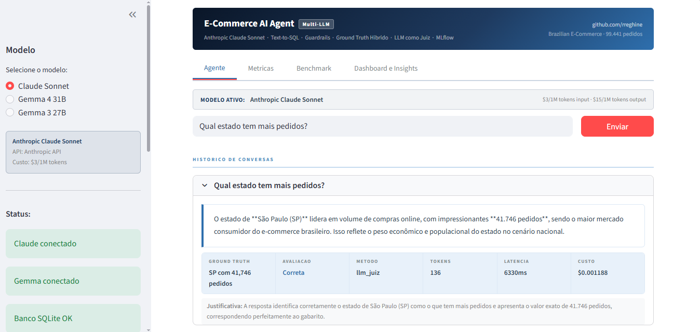
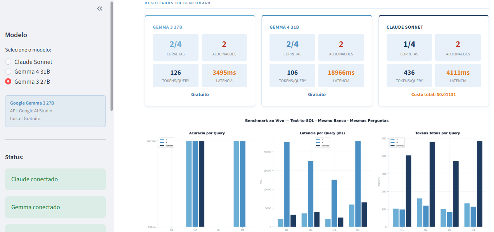
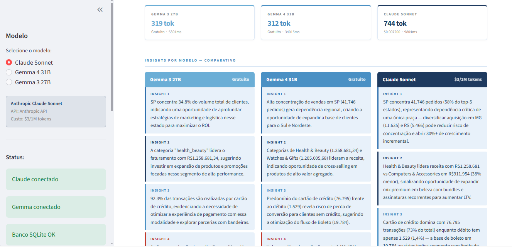

🇺🇸 **English** | [🇧🇷 Português](README.pt-BR.md)

# E-Commerce AI Agent — Sonnet (Claude) + Gemma 3/4 (Google)


AI agent for e-commerce analysis supporting 3 language models —
Anthropic Claude Sonnet, Google Gemma 3 27B, and Google Gemma 4 31B. Uses
Text-to-SQL over a real SQLite database, hybrid evaluation with dynamic Ground
Truth and LLM-as-a-Judge, automatic SQL retry, MLflow tracking, and a live
benchmark where the 3 models answer the same questions on the same database
for a fair comparison of accuracy, tokens, latency, and cost.

---

## Preview

### Agent Interface


### Multi-LLM Benchmark


### Dashboard with Insights from the 3 Models


---

## Evolution from Part 1

| Component | Part 1 | Part 2 |
|---|---|---|
| Main LLM | Google Gemma 3 | Anthropic Claude Sonnet |
| Data | CSV + RAG + FAISS | SQLite + Text-to-SQL |
| Evaluation | Word overlap | Numeric + LLM-as-a-Judge |
| Cost | Estimated | Real — usage API |
| Retry | No | Yes — SQL automatically corrected |
| Observability | MLflow | MLflow |
| Models | 1 | 3 — Gemma 3, Gemma 4, Claude |
| Tabs | 2 | 4 — Agent, Metrics, Benchmark, Dashboard |

---

## Architecture

```
User question
        |
Guardrails — validates scope, sensitive data, and length
        |
Text-to-SQL — Claude converts the question into SQL
        |
SQLite — runs the query on real data (zero hallucination on numbers)
        |
Claude — interprets the result
        |
Hybrid Evaluator
    |-- Numeric: relative error <= 2% correct / <= 10% partial
    |-- LLM Judge: Claude semantically evaluates its own answer
        |
MLflow — logs real tokens, cost, latency, hallucination score
        |
Streamlit — 4 tabs
    |-- Agent: chat with inline evaluation
    |-- Metrics: session dashboard
    |-- Benchmark: 3 models, same question, live comparison
    |-- Dashboard: insights generated by the 3 models simultaneously
```

---

## Dataset

**Brazilian E-Commerce (Kaggle)**

- 99,441 real, anonymized orders
- 7 related tables — orders, customers, products, sellers, payments, reviews
- Period: 2016 to 2018
- 100% Brazilian market context

---

## Repository Structure

```
ai-agent-part2/
|
|-- Agent_Claude_SQL.ipynb
|-- app.py
|-- olist.db
|-- requirements.txt
|-- preview_agente.png
|-- preview_benchmark.png
|-- preview_dashboard.png
|-- README.md
```

---

## Components

### Guardrails
Two-level validation — input and output:

- Scope validation — blocks questions outside the e-commerce domain
- Data protection — prevents exposure of personal data (national IDs, passwords)
- Length control — minimum 5 and maximum 500 characters

### Text-to-SQL with Automatic Retry
Claude converts natural language into valid SQL and executes it on the database:

```
Question -> Claude generates SQL -> SQLite executes
                |
           SQL error?
                |
         Claude fixes it -> SQLite re-executes (max 2 attempts)
```

Advantage over RAG: zero hallucination on numbers — values come straight from the database.

### Hybrid Evaluator

**Numeric Evaluation** — for questions with quantitative answers:

| Relative Error | Status |
|---|---|
| <= 2% | Correct |
| <= 10% | Partial |
| > 10% | Hallucination |

**LLM-as-a-Judge** — for open-ended questions:

Claude receives the question, the ground truth, and the agent's answer, and evaluates it semantically, returning a score from 0 to 1 with a justification.

### Dynamic Ground Truth
Computed directly on the database via SQL — not hardcoded:

- Delay rate: computed by comparing actual dates
- State with the most orders: real count per state
- 8 question types with automatic ground truth

### Live Benchmark
The 3 models receive the same questions, use the same SQLite database, and the same Text-to-SQL method. The only variable is the language model.

**Available models:**

| Model | API | Cost |
|---|---|---|
| Google Gemma 3 27B | Google AI Studio | Free |
| Google Gemma 4 31B | Google AI Studio | Free |
| Anthropic Claude Sonnet | Anthropic API | $3/1M input tokens |

### Dashboard with Insights from the 3 Models
The 3 models analyze the same data and generate 5 independent strategic insights. The user sees the difference in quality, depth, and cost in real time.

---

## Technologies Used

| Category | Tools |
|---|---|
| Language | Python 3.12 |
| LLMs | Anthropic Claude Sonnet · Google Gemma 3 27B · Google Gemma 4 31B |
| Database | SQLite |
| Method | Text-to-SQL |
| Evaluation | Hybrid Ground Truth + LLM-as-a-Judge |
| Tracking | MLflow |
| Interface | Streamlit |
| Environment | Google Colab |

---

## Author

**Rafael Reghine Munhoz**
Data Analyst | Data Science & Analytics | MBA at USP

[](https://linkedin.com/in/rafaelreghine)
[](https://github.com/rreghine)
